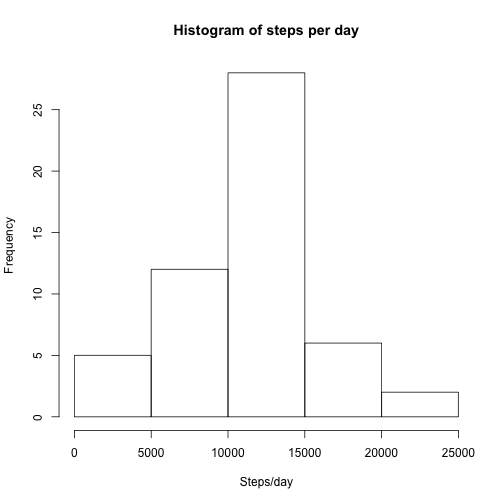
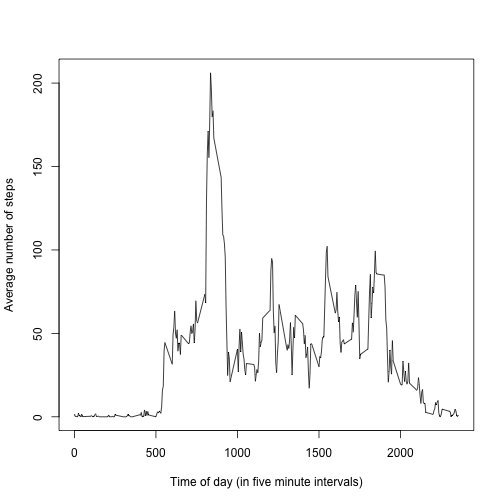
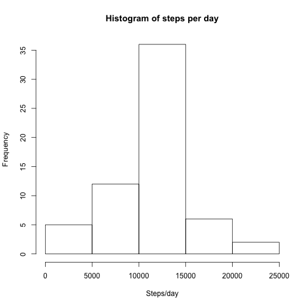
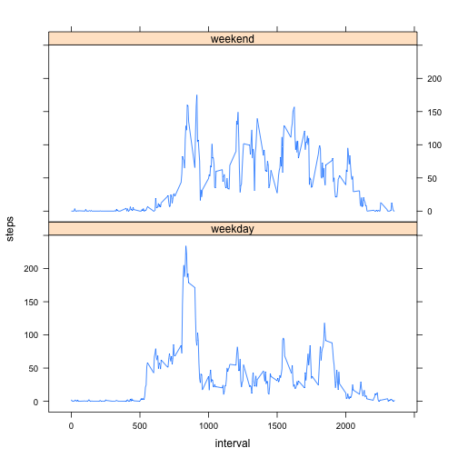

# Reproducible Research: Peer Assessment 1


## Loading and preprocessing the data

1. Load the data.

    The data is loaded into a `data.table`, a data structured introduced in the *Getting and Cleaning Data* course, the third course of the *Specialization in Data Science*.

    
    ```r
    library(data.table)
    data <- data.table(read.csv(unz('activity.zip', 'activity.csv')))
    ```

2. Process/transform the data (if necessary) into a format suitable for your analysis.
    
    ```r
    # Convert character strings representing dates into date objects:
    data[,date:=as.Date(date)]
    ```

## What is mean total number of steps taken per day?

1. Make a histogram of the total number of steps taken each day.
    
    ```r
    daily.steps <- data[,sum(steps),by=date][,na.omit(V1)]
    hist(daily.steps,xlab='Steps/day', main="Histogram of steps per day")
    ```
    
     

2. Calculate and report the **mean** and **median** total number of steps taken per day.
    
    ```r
    library(xtable)
    print(xtable(data.frame(Mean=mean(daily.steps), Median=median(daily.steps))), type='html')
    ```
    
    <!-- html table generated in R 3.1.0 by xtable 1.7-3 package -->
    <!-- Tue Aug 12 02:45:04 2014 -->
    <TABLE border=1>
    <TR> <TH>  </TH> <TH> Mean </TH> <TH> Median </TH>  </TR>
      <TR> <TD align="right"> 1 </TD> <TD align="right"> 10766.19 </TD> <TD align="right"> 10765 </TD> </TR>
       </TABLE>

## What is the average daily activity pattern?

1. Make a time series plot (i.e. `type = "l"`) of the 5-minute interval (x-axis) and the average number of steps taken, averaged across all days (y-axis).
    
    ```r
    daily.pattern <- data[,list(steps=mean(steps,na.rm=T)),by=interval]
    plot(daily.pattern,type='l',
         xlab='Time of day (in five minute intervals)',
         ylab='Average number of steps'
         )
    ```
    
     

2. Which 5-minute interval, on average across all the days in the dataset, contains the maximum number of steps?
    
    ```r
    daily.pattern[which.max(steps)]$interval
    ```
    
    ```
    ## [1] 835
    ```

## Imputing missing values

1. Calculate and report the total number of missing values in the dataset (i.e. the total number of rows with `NA`s).
    
    ```r
    data[is.na(steps),.N]
    ```
    
    ```
    ## [1] 2304
    ```

2. Devise a strategy for filling in all of the missing values in the dataset.

    **Imputing strategy:** The strategy chosen for filling in all of the missing values in the dataset is to take the mean for that 5-minute interval         across all days.

3. Create a new dataset that is equal to the original dataset but with the missing data filled in.
    
    ```r
    data1 <- copy(data)
    data1[,imputed:=mean(steps,na.rm=T),by=interval]
    data1[!is.na(steps), imputed:=steps]
    ```

4. Make a histogram of the total number of steps taken each day and Calculate and report the mean and median total number of steps taken per day. Do these values differ from the estimates from the first part of the assignment? What is the impact of imputing missing data on the estimates of the total daily number of steps?
    
    ```r
    daily.steps.imputed <- data1[,sum(imputed),by=date]
    hist(daily.steps.imputed[,V1],xlab='Steps/day', main="Histogram of steps per day")
    ```
    
     
    
    ```r
    print(xtable(daily.steps.imputed[,list(Mean=mean(V1),Median=median(V1))]), type='html')
    ```
    
    <!-- html table generated in R 3.1.0 by xtable 1.7-3 package -->
    <!-- Tue Aug 12 02:45:04 2014 -->
    <TABLE border=1>
    <TR> <TH>  </TH> <TH> Mean </TH> <TH> Median </TH>  </TR>
      <TR> <TD align="right"> 1 </TD> <TD align="right"> 10766.19 </TD> <TD align="right"> 10766.19 </TD> </TR>
       </TABLE>

    The mean is unchanged while the median moves towards the mean. The effect on the histogram is to make the peak around the median and the mean more pronounced.

## Are there differences in activity patterns between weekdays and weekends?

1. Create a new factor variable in the dataset with two levels – “weekday” and “weekend” indicating whether a given date is a weekday or weekend day.
    
    ```r
    data[,weekend := factor(weekdays(date,abbreviate = T) %in% c('Sat', 'Sun'), labels=c('weekday', 'weekend'))]
    daily.pattern.panel <- data[,list(steps=mean(steps,na.rm=T)),by=list(interval,weekend)]
    ```
2. Make a panel plot containing a time series plot (i.e. `type = "l"`) of the 5-minute interval (x-axis) and the average number of steps taken, averaged across all weekday days or weekend days (y-axis).

```r
    library(lattice)
    xyplot(steps ~ interval | weekend, data=daily.pattern.panel, type='l', layout=c(1,2))
```

 
